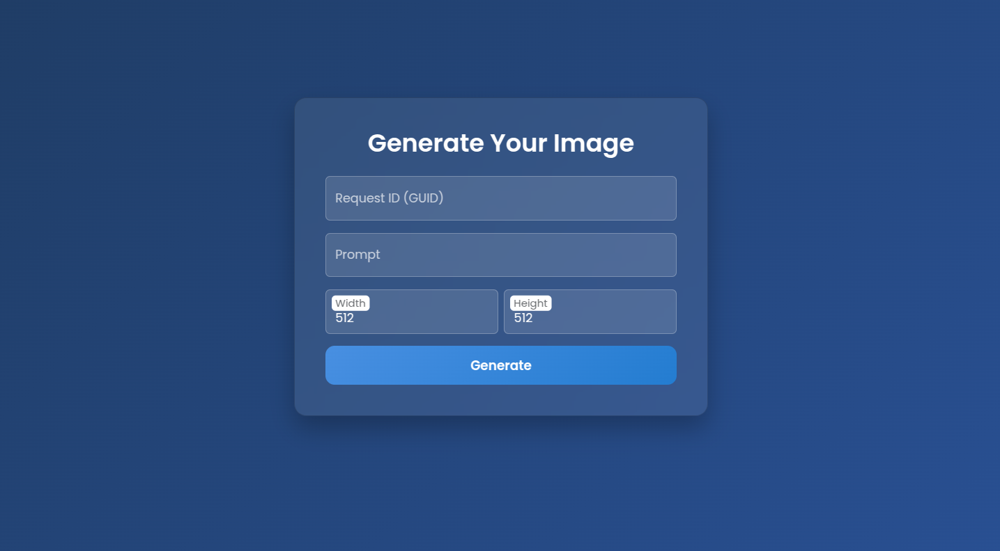

# Whisperwynd Story Generator 🌬️📖

## Overview

**Whisperwynd Story Generator** is an AI-powered storytelling and world-building platform that brings fictional universes to life. Developed using **Microsoft Copilot Studio** and **Azure AI**, this application enhances user engagement through interactive narrative experiences, scene visualization, and dynamic world creation tools. Originally built to animate a 20,000-word children’s book, Whisperwynd now empowers users to co-create immersive story worlds, generate new character-consistent tales, and visualize them in real time.

## Problem Statement

In traditional storytelling, expanding fictional worlds and creating interactive reader experiences often require significant manual effort, technical expertise, and creative input. There is a lack of accessible platforms that let users co-create expansive, consistent, and visually rich story universes—especially ones that leverage AI to extend canon material or enable new narratives aligned with a story world.

## Solution

Whisperwynd Story Generator addresses this gap by offering an intuitive, AI-driven platform that:

- Uses **Retrieval-Augmented Generation (RAG)** to let users explore and extend a story trained on an original children’s book.
- Provides a **chatbot interface** for creating new stories interactively.
- Empowers users to **build their own fictional worlds**, adding topics, locations, and mini-stories.
- Automatically **maps relationships** between characters and settings to preserve narrative consistency.
- **Generates images** from scene descriptions using generative AI.
- Supports **virtual map creation**, tying geography to plot dynamics.
- Allows one-click **story publishing** to public platforms.

All built on Microsoft’s AI stack and deployed through **Azure Web Services** and **Copilot Studio**.

## Tech Stack

- **AI & NLP**: Azure OpenAI (GPT + RAG)
- **AI Agent**: Microsoft Copilot Studio
- **Frontend**: Azure web App and HTML Document(Image Preview)
- **Cloud Services**: Azure Web Services, Azure Blob Storage, SharePoint,Microsfot Office 365, Microsoft Teams
- **Image Generation**: Python Flask Application with Comfy UI running on a thriday party GPU cloud service
- **Version Control & Maintenance**: GitHub for source code management, collaboration, and issue tracking

## Team Members

- [Eric Silver](https://github.com/ARGENTQUEST)
- [Bhaskar Dasari](https://github.com/BhaskarDasari)  
- [Ahmed Mordi](https://github.com/ahmedmmordi)  
- [Mithradevi_K](https://github.com/MITHRADEVIKcse2023)  

## Contributing & Code Maintenance

All project code is version-controlled and actively maintained in a GitHub repository to ensure:
- Easy collaboration and code reviews within the team
- CI/CD workflows for deployment using GitHub Actions and Azure will be implemented in future
- Transparent issue tracking and feature planning
- Secure and structured documentation of contributions

We follow GitHub best practices, including:
- `main` branch protection
- Pull request approvals
- Semantic commit messages
- Weekly code reviews and merge cycles

## Demo

🔗 *Coming Soon* – A live demo video and walkthrough will be added here.

## Future Work

- Sentiment Analysis by using AI to detect the tone and emotions in the story, giving users feedback on how their writing feels (e.g., happy, sad, exciting).
- Using Azure database for managing all the world data, which we do with sharepoint currently
- Implement story-to-PDF conversion for offline sharing.
- Integrate Copilot agent with Azure DevOps for seemless deployments.
- Expand story publishing to platforms like Medium, Substack, and Kindle.
- Integrate gamification elements into the storytelling experience.
- Enable collaborative world-building sessions in real time.


## Why Microsoft?

This project would not be possible without the power and flexibility of Microsoft’s AI and cloud ecosystem:

- **Copilot Studio** for low-code AI agent development  
- **Azure OpenAI** for large language model integration  
- **Azure AI Search** to power semantic document retrieva. Whisperwynd story book was added to the AI search service
- **Azure Blob Storage** for storing generated images
- **SharePoint** for maintaining of data tables associated with world definition, data storage and the knowledge base
- **Azure Web Services** for reliable deployment and monitoring of python endpoint 
- **GitHub** for professional code management and DevOps

---
## Setup Instructions

1. This project is hosted on a Azure Office 365 tenant and azure web app(not exposed to public) and invokes an AI agent.
2. Interact with the AI chatbot trained on the original book.
3. Generate or explore custom stories and visualizations.

The backend source code is maintained in a public GitHub repository, which includes:
- Copilot Studio agent solution
- Codebase for Flask-powered image generation services

### 🔧 Setup for Copilot Studio Agent

Set up your AI agent using **Microsoft Copilot Studio**, integrated with **Azure OpenAI** and **Azure AI Search**:

- **Create Agent**  
  - Go to [Copilot Studio](https://copilotstudio.microsoft.com/)  
  - Create custom copilot agent

- **Configure Retrieval-Augmented Generation (RAG)**  
  - Upload your book content (e.g., 20,000 words) to **Azure Blob Storage**  
  - Use **Azure AI Search** to index the content  
  - Connect this search index to your agent via custom actions or plugins

- **Integrate Azure OpenAI**  
  - Deploy an OpenAI resource from the **Azure Portal**  
  - Use `gpt-4` or `gpt-35-turbo`, and get the API key and endpoint  
  - Call the endpoint using **Power Automate** or a **Custom Connector**

- **Design Conversation Flow(POwer Automate)**  
  - Use the canvas to build guided Q&A for story generation  
  - Store user inputs in **blob storage**, **SharePoint**, or custom backend  
  - Support for world-building, image prompts, and branching narratives

- **Deploy & Test**  
  - Use the built-in web chat to test your agent inside copilot studio and microsoft teams 
  - Deploy to web (e.g., Azure website, medium)
  - Monitor performance via **Copilot Analytics**
- **Agent Outcome Preview**  
  - [view sample file](https://github.com/BhaskarDasari/Whisperwynd-Story-Generator/blob/main/Sample%20Story%20Generated%20By%20Copilot%20AI%20Agent.pdf)

### 🔧 Setup for Flask app

#### 1. Clone the Repository

```bash
git clone https://github.com/BhaskarDasari/Whisperwynd-Story-Generator.git
cd Whisperwynd-Story-Generator/app
```

#### 2. Configure `.env`

Create a `.env` file based on `.env.example` and add:

```
API_URL=your_runpod_url
BEARER_TOKEN=your_runpod_token
AZURE_CONN_STR=your_azure_blob_connection_string
CONTAINER_NAME=images
```

#### 3. Generate a UUID

```bash
python GetUUID.py
```

Copy and use this UUID for requests.

#### 4. Run the App

```bash
python app.py
```

Then open [http://127.0.0.1:5000](http://127.0.0.1:5000) in your browser.

---

### How It Works

#### 🔹 Image Generation Workflow

1. User submits a **prompt** and **UUID**.
2. App starts a job via RunPod API.
3. It polls until job is complete.
4. Downloads the image (from URL or base64).
5. Saves to disk and uploads to Azure Blob.
6. Returns both local and Azure URLs.

#### 🔹 HTML to PDF Workflow

1. User sends HTML content + UUID.
2. WeasyPrint converts it into PDF.
3. The file is saved and uploaded.
4. Azure PDF link is returned.

---

### API Endpoints

#### 🔸 `/generate` — Generate Image

**POST JSON:**
```json
{
  "request_id": "uuid",
  "prompt": "A dragon flying over mountains",
  "width": 512,
  "height": 512
}
```

**Response:**
```json
{
  "status": "success",
  "image_url": "/generated_images/uuid.png",
  "blob_url": "https://<azure>/uuid.png"
}
```

---

#### 🔸 `/convert_html_to_pdf` — Convert HTML to PDF

**POST JSON:**
```json
{
  "request_id": "uuid",
  "html": "<h1>Hello PDF</h1><p>This is a test.</p>"
}
```

**Response:**
```json
{
  "status": "success",
  "pdf_blob_url": "https://<azure>/uuid.pdf"
}
```

---

## Overview

This application enables users to:

- Generate AI images via the **RunPod API**
- Convert HTML to PDF using **WeasyPrint**
- Store files on **Azure Blob Storage**
- Interact through a **simple web UI** or **REST API**

---

## Requirements

- Python 3.8+
- Flask
- requests
- weasyprint
- azure-storage-blob

Install them via:

```bash
pip install -r app/requirements.txt
```

---

## Interface Preview

The interface allows inputting prompts, triggering image generation, and downloading results:



---
### Tips & Best Practices

- Use a **new UUID** for each operation to prevent overwriting.
- **.env** file must be properly configured for Azure + RunPod access.
- Keep `.env` secure and untracked (Set `.gitignore`).
- Test the endpoints.
---


## Project Structure

```
Whisperwynd-Story-Generator/
├── app/
│   ├── app.py                # Main Flask application
│   ├── GetUUID.py            # UUID generator script
│   ├── To_PDF.py             # Optional script for PDF conversion
│   ├── requirements.txt      # Python dependencies
│   ├── templates/
│   │   └── index.html        # Web interface template
│   └── static/
│       ├── screenshot.png    # Preview image
│       └── generated_images/ # Folder for output images/PDFs
└── README.md                  # Project documentation
```

---

